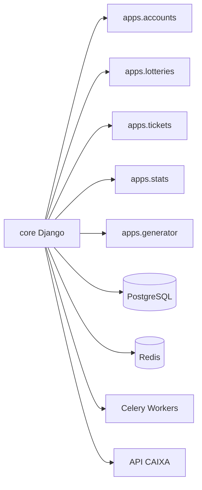

## Diagramas de Dependências

### Arquitetura Geral

```mermaid
graph TD
  Client[Frontend (React + Vite)] -->|REST / GraphQL| Server[Backend (Django + DRF)]
  Server --> DB[(PostgreSQL)]
  Server --> Cache[(Redis)]
  Server -->|Async| Celery[Celery Workers]
  Server -->|Sync| Caixa[API CAIXA]
  Celery -->|Broker| Redis
```

### Frontend — dependências e fluxos

```mermaid
graph LR
  App[`src/App.tsx` - Pages] --> Pages[Pages (/pages)]
  App --> Components[Components (/components, design-system)]
  Components --> UI[Design System (atoms/molecules)]
  App --> Libs[Libs (`src/lib`)]
  UI --> Tailwind[TailwindCSS]
  Libs --> Query[TanStack Query]
  App --> Router[react-router-dom]
  App --> React[react]
  App --> Vite[vite]
```

Principais bibliotecas (extraídas de `package.json`):
- `react`, `react-dom`
- `vite`, `vitest` (testes)
- `tailwindcss`, `@tailwindcss/typography`
- `@tanstack/react-query`
- `react-router-dom`, `zod`, `react-hook-form`

### Backend — apps e integrações



Dependências principais (de `backend/requirements.txt`): `Django`, `djangorestframework`, `psycopg`, `redis`, `celery`, `drf-spectacular`.

## Observações rápidas detectadas (auditoria estática inicial)

- Existem `TODO` no frontend (`src/hooks/useLotteryData.ts`, `src/shared/api/apiClient.ts`) que indicam chamadas temporárias ou tratamento de logout não finalizado.
- Há um `print(...)` em `backend/core/celery.py` que parece ser debugging e deve ser substituído por logging apropriado.
- Testes não puderam ser executados neste ambiente porque as dependências não estão instaladas (ver seção abaixo).

## Como instalar dependências e rodar testes localmente

1) Frontend (Node):

```bash
cd "c:\Users\bsbpl\Documentos 1\Projetos\cebolaoloterias_web"
npm install
npm run test
```

2) Backend (Python):

```bash
cd "c:\Users\bsbpl\Documentos 1\Projetos\cebolaoloterias_web\backend"
python -m venv .venv
.\.venv\Scripts\Activate.ps1   # PowerShell
pip install -r requirements.txt
pytest
```

Ou use o script fornecido `setup_dev.bat` que automatiza o processo descrito no README.

## Próximos passos sugeridos

- Remover `print` em `backend/core/celery.py` e usar `logging.getLogger(__name__)`.
- Implementar fluxo de logout/refresh indicado em `src/shared/api/apiClient.ts`.
- Completar os `TODO` em `src/hooks/useLotteryData.ts` com chamadas reais para a API e adicionar testes.
- Rodar `ruff`/`isort` e `eslint` para alinhar estilo e corrigir avisos.
- Configurar CI (GitHub Actions) para rodar `pytest` e `vitest` em PRs.

---

Arquivo gerado automaticamente por análise inicial — revise antes de commitar alterações no repositório.
